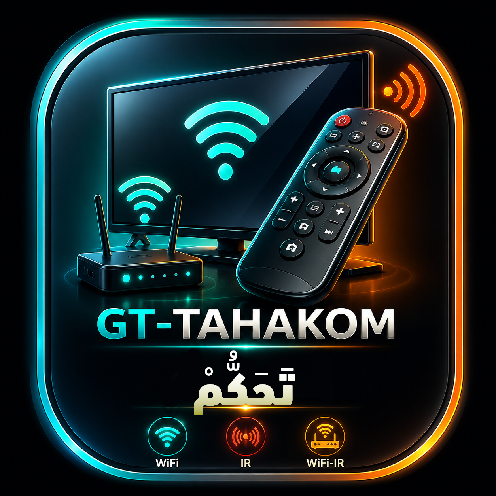

<div dir="rtl" align="right">

<p align="center">
  
</p>

<h1 align="center">GT-TAHAKOM — تَحَكُّمْ</h1>

<p align="center">
  تطبيق أندرويد حديث للتحكّم في التلفاز والأجهزة الإلكترونية عبر وسائل متعددة:
  الشبكة (WiFi) والأشعة تحت الحمراء (IR) وجسر WiFi-IR.
</p>

<p align="center">
  
  
  
  
</p>

---

## الفكرة

على عكس تطبيقات الريموت التقليدية التي تعتمد على باعث IR المدمج (نادر في الهواتف الحديثة)،
يعمل **GT-TAHAKOM** كـ **مركز تحكّم موحّد** يكتشف الوسيلة المناسبة لكل جهاز ويستخدمها تلقائياً:

| الوسيلة | يتحكّم في |
| :--- | :--- |
| 🌐 شبكة WiFi | تلفازات Android TV / Google TV، صناديق أندرويد (أصلية وصينية)، Roku، Samsung (Tizen)، LG (webOS)، Sony Bravia |
| 🔴 أشعة تحت الحمراء | أي جهاز IR قديم (على الهواتف ذات الباعث المدمج) |
| 📡 جسر WiFi-IR | أجهزة IR من **أي هاتف** عبر Broadlink |

> الإلهام المعماري مقتبس من مشروع [IRRemote](https://github.com/Divested-Mobile/IRRemote) (GPLv3) مع تعميم طبقة الإرسال من IR-only إلى وسائل نقل متعددة، وإضافة العربية/RTL.

---

## المزايا

- **اكتشاف ذكي للأجهزة:** تلقائي كامل للأجهزة الشبكية (mDNS/SSDP)، وشبه آلي لأجهزة IR. **يعمل بلا إنترنت** ([docs/DISCOVERY.md](docs/DISCOVERY.md) · [docs/DATABASE.md](docs/DATABASE.md)).
- **بحث بالاسم والطراز** إضافةً إلى الاكتشاف التلقائي.
- **عربي + إنجليزي** مع تبديل فوري من الإعدادات (per-app locale).
- **مشاركة حزم الريموت** (`.tahakom`): شارك إعداد علامة كاملة أو طراز محدّد؛ وعند نقر المستلِم على الملف يفتح **مباشرة** في التطبيق. التفاصيل في [docs/SHARING.md](docs/SHARING.md).
- واجهة Material 3 بألوان الهوية (سماوي/برتقالي) مع داكن/فاتح و RTL.

---

## الحالة الراهنة

- **م0 (التأسيس) ✅** — مشروع Kotlin/Compose، طبقة `Transport` المجرّدة، النموذج الموحّد، `IrTransport`، Hilt، أيقونة، توثيق.
- **م1 (الاكتشاف) ✅** — اكتشاف حيّ عبر mDNS (`NsdManager`) + SSDP (UDP multicast)، دمج وإزالة تكرار، شاشة أجهزة حيّة. **أوفلاين بالكامل.**
- مزايا إضافية: تبديل اللغة، صيغة `.tahakom` + الفتح المباشر.
- **التالي: م2** — أول وسيلتي نقل (Android TV + Roku) + شاشة الريموت. **يبني APK بنجاح.**

خطة المراحل الكاملة في [docs/ARCHITECTURE.md](docs/ARCHITECTURE.md#خطة-المراحل).

---

## البناء

المتطلبات: JDK 17، Android SDK (platform 36، build-tools 35+).

```bash
./gradlew assembleDebug          # بناء APK تجريبي
./gradlew installDebug           # تثبيت على جهاز/محاكي متصل
```

أو افتح المجلد مباشرة في **Android Studio** (Ladybug أو أحدث).

---

## الترخيص

[GPLv3](LICENSE) — برنامج حر ومفتوح المصدر، تماشياً مع مشروع IRRemote المُقتبَس منه.

**المطوّر:** GNUTUX · [github.com/SalehGNUTUX/GT-TAHAKOM](https://github.com/SalehGNUTUX/GT-TAHAKOM)

</div>
