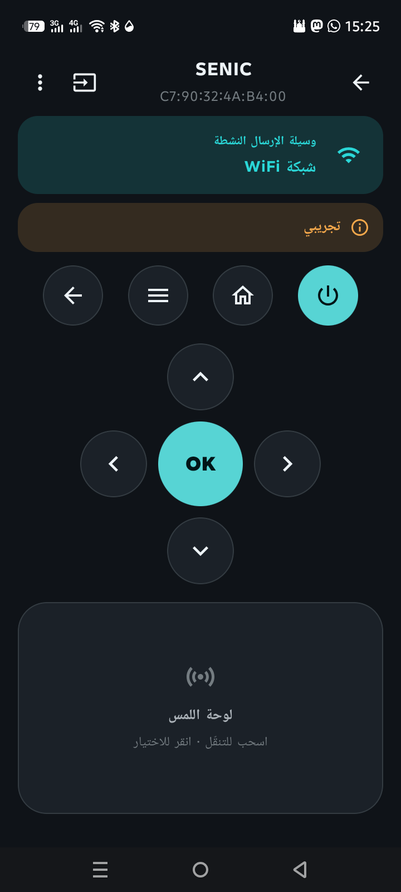

# بيانات الاختبار الميداني — GT-TAHAKOM

> العربية · [English](en/TEST_NOTES.md)

سجلّ نتائج تجارب المستخدم على أجهزة حقيقية، لتكوين صورة كاملة قبل بدء تطوير كل إصدار.
كل مدخلة: الجهاز + الوسيلة + ما حدث + التحليل + إجراءات الإصدار القادم.

> **لماذا هنا؟** الميزات التجريبية (Android TV، Broadlink) غير مُتحقَّقة على جهاز —
> الاختبار الميداني هو مصدرنا الوحيد لضبطها. راجع «ما تبقّى» في [STATUS.md](STATUS.md).

---

## فهرس سريع
| # | الجهاز | الوسيلة | الإصدار | النتيجة | الحالة |
|---|---|---|---|---|---|
| 1 | SENIC (مستقبل أندرويد) | AndroidTvTransport (تجريبي) | 1.0.0 | حقل إدخال الرمز ظهر، لكن لا رمز على شاشة التلفاز | قيد التحليل |

---

## #1 — SENIC (مستقبل يعمل بأندرويد) · AndroidTvTransport · v1.0.0

**التاريخ:** 2026-06-04
**الجهاز:** SENIC — معرّف/MAC: `C7:90:32:4A:B4:00`
**الوسيلة:** WiFi → `AndroidTvTransport` (موسومة «تجريبي»).
**سياق الشاشة وقت التجربة:** التلفاز كان يشغّل **فيديو يوتيوب بملء الشاشة**.

### الملاحظة
بعد النقر على «إقران»، **ظهر حقل إدخال رقم الإقران داخل التطبيق**، لكن **لم يظهر أي رمز
على شاشة التلفاز**، فتعذّر إكمال الإقران.

### التحليل (من قراءة الكود)
- في `AndroidTvPairViewModel.kt`، حقل إدخال الرمز (`PairStage.ENTER_CODE`) **لا يظهر إلا إذا
  أرجعت `AndroidTvPairing.start()` القيمة `true`**.
- و`start()` (في `AndroidTvPairing.kt`) تُرجع `true` فقط بعد: نجاح مصافحة TLS على المنفذ
  **6467** + تبادل رسائل polo الثلاث (request → option → **configuration**) واستلام ردّ على كلٍّ.
- **الاستنتاج:** ظهور الحقل يُثبت أن الاتصال وصل للخطوة التي يُفترض أن يَعرض التلفاز فيها الرمز.
  فالمشكلة ليست في الوصول إلى الجهاز.

**سببان مرجّحان (غير حصريين):**
1. **عدم التحقّق من حالة الردّ:** `start()` تكتفي بأن الردّ **غير فارغ** (`AtvFrames.read != null`)
   ولا تفحص `status == 200`. فلو ردّ الجهاز **بخطأ** على رسالة الإعداد (أرقام حقول polo عندنا من
   المواصفة، غير مُتحقَّقة على جهاز)، يَعتبرها الكود «نجاحاً» ويقفز لإدخال الرمز **دون أن يكون
   التلفاز قد طُلب منه عرض رمز**. ← **الأرجح، ويفسّر العَرَض كاملاً.**
2. **الفيديو الغامر يحجب طبقة النظام:** رمز الإقران تعرضه خدمة نظام أندرويد فوق التطبيقات؛ بعض
   الأنظمة (خاصة مستقبلات أندرويد العامة، لا Google TV المعتمد) قد لا ترسم نافذة النظام فوق فيديو
   يعمل بوضع immersive/fullscreen. ← محتمل، وأرخص تجربة للاستبعاد.

**ملاحظات مساعدة:**
- الـMAC يبدأ بـ `C7` (البت المحلي مضبوط) → عنوان «مُدار محلياً/عشوائي»، شائع للخصوصية في أندرويد
  الحديث — **ليس دليلاً** على نوع الجهاز بذاته.
- «مستقبل يعمل بأندرويد» قد يكون **أندرويد عاماً (AOSP)** لا **Android TV/Google TV المعتمد**؛
  الأول قد لا يحوي «خدمة التحكّم عن بُعد» (Remote v2) التي تعرض الرمز رغم استجابته على 6467.

### إجراءات الإصدار القادم
- [ ] **التحقّق من حالة الردّ** في `start()` عند كل خطوة polo (`status == 200`) بدل فحص الفراغ فقط،
      فلا يُعرض حقل الرمز إلا بعد قبول الجهاز رسالة الإعداد فعلاً.
- [ ] **تسجيل بايتات/حالة الردّ** الخام عند كل خطوة (request/option/configuration) للتشخيص.
- [ ] **إعادة الاختبار من الشاشة الرئيسية للجهاز** (الخروج من يوتيوب) لاستبعاد حجب الطبقة الغامرة.
- [ ] **تأكيد صنف الجهاز:** هل يُقرَن SENIC عبر تطبيق Google الرسمي «Google TV»/«Android TV
      Remote»؟ إن عرض الرمز هناك → العلّة في تنفيذنا (أرقام حقول/تسلسل polo)؛ إن لم يعرض → الجهاز
      لا يدعم بروتوكول Remote v2 ولا يصلح هذا المسار له.
- [ ] التقاط رمز خطأ مفهوم للمستخدم يميّز «الجهاز رفض الإعداد» عن «انتهت المهلة دون إدخال».

### ملفات ذات صلة
- `core/transport/impl/androidtv/AndroidTvPairing.kt` (تسلسل polo + المنفذ 6467)
- `core/transport/impl/androidtv/AndroidTvCrypto.kt` (TLS + حساب السرّ)
- `feature/androidtv/AndroidTvPairViewModel.kt` (مراحل الإقران)
