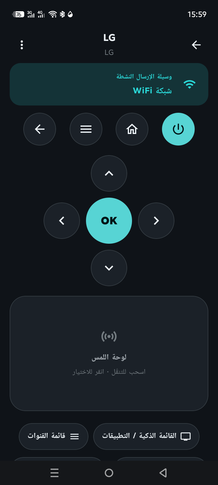
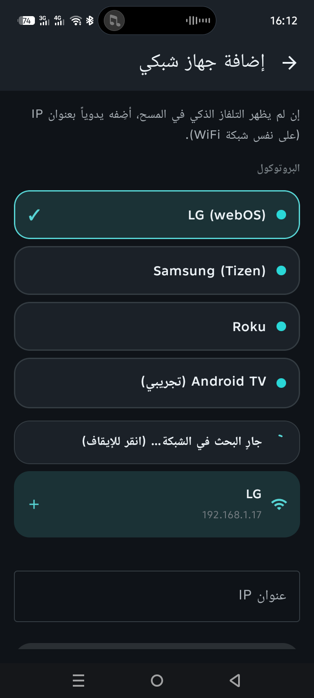
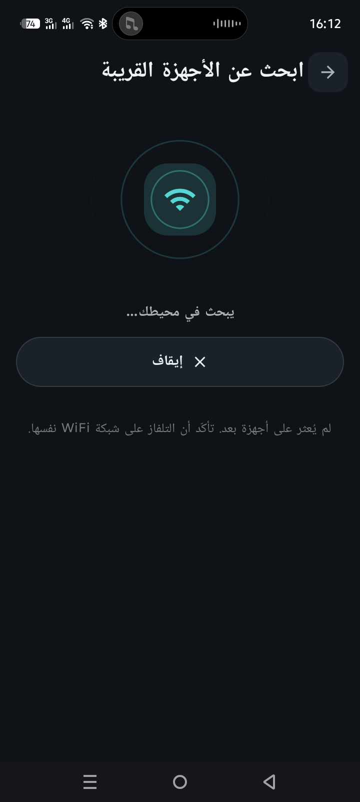
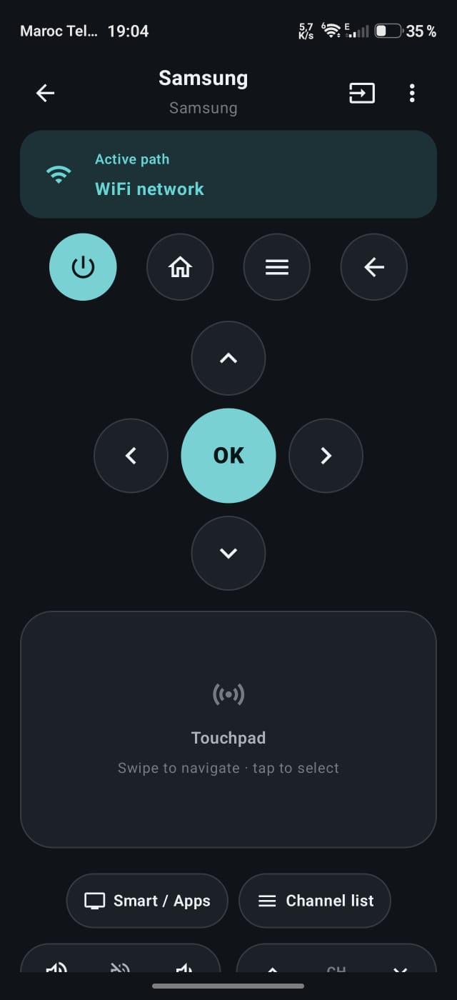
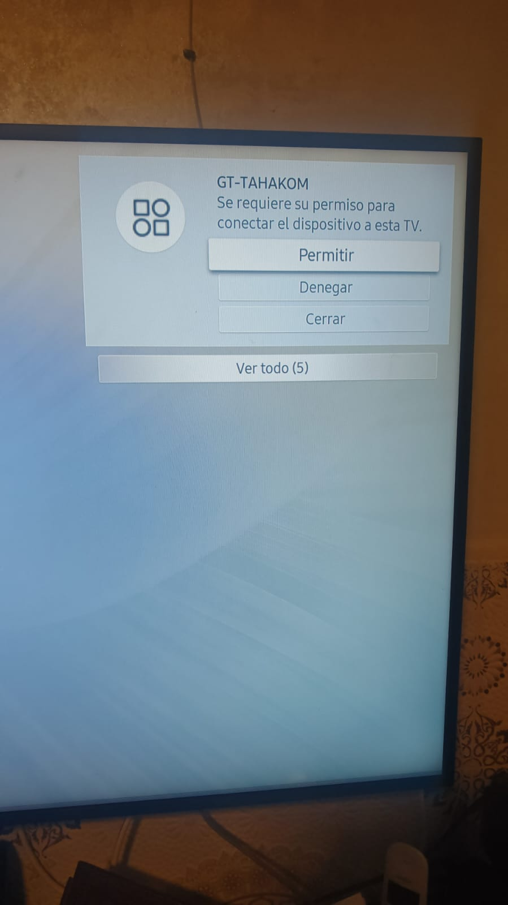

# بيانات الاختبار الميداني — GT-TAHAKOM

> العربية · [English](en/TEST_NOTES.md)

سجلّ نتائج تجارب المستخدم على أجهزة حقيقية، لتكوين صورة كاملة قبل بدء تطوير كل إصدار.
كل مدخلة: الجهاز + الوسيلة + ما حدث + التحليل + إجراءات الإصدار القادم.

> **لماذا هنا؟** الميزات التجريبية (Android TV، Broadlink) غير مُتحقَّقة على جهاز —
> الاختبار الميداني هو مصدرنا الوحيد لضبطها. راجع «ما تبقّى» في [STATUS.md](STATUS.md).

---

## فهرس سريع
| # | الجهاز | الوسيلة | الإصدار | النتيجة | الحالة |
|---|---|---|---|---|---|
| 1 | SENIC (مستقبل أندرويد) | AndroidTvTransport (تجريبي) | 1.0.0 | حقل إدخال الرمز ظهر، لكن لا رمز على شاشة التلفاز | قيد التحليل |
| 2 | LG (webOS) @192.168.1.17 | WebosTransport (SSAP) | 1.0.0 | تحكّم أساسي يعمل؛ التطبيقات/القائمة الذكية والتنقّل/لوحة اللمس لا تعمل؛ المسح العام لا يجده | شُخِّص (علّتان في التطبيق) |
| 3 | عام (تجربة UX) | الإضافة من المسح + ترتيب القائمة | 1.0.0 | الإضافة من المسح لا تفتح الريموت؛ الأحدث لا يظهر بالأعلى | ✅ أُصلِح |
| 4 | Samsung (Tizen) — صديق | SamsungTizenTransport (WebSocket) | 1.0.0 | الإقران يُقبَل على التلفاز، لكن لا يستجيب أي زر بعدها | شُخِّص (علّة جلسة-لكل-أمر) |

---

## #1 — SENIC (مستقبل يعمل بأندرويد) · AndroidTvTransport · v1.0.0

**التاريخ:** 2026-06-04
**الجهاز:** SENIC — معرّف/MAC: `C7:90:32:4A:B4:00`
**الوسيلة:** WiFi → `AndroidTvTransport` (موسومة «تجريبي»).
**سياق الشاشة وقت التجربة:** التلفاز كان يشغّل **فيديو يوتيوب بملء الشاشة**.

### الملاحظة
بعد النقر على «إقران»، **ظهر حقل إدخال رقم الإقران داخل التطبيق**، لكن **لم يظهر أي رمز
على شاشة التلفاز**، فتعذّر إكمال الإقران.

### التحليل (من قراءة الكود)
- في `AndroidTvPairViewModel.kt`، حقل إدخال الرمز (`PairStage.ENTER_CODE`) **لا يظهر إلا إذا
  أرجعت `AndroidTvPairing.start()` القيمة `true`**.
- و`start()` (في `AndroidTvPairing.kt`) تُرجع `true` فقط بعد: نجاح مصافحة TLS على المنفذ
  **6467** + تبادل رسائل polo الثلاث (request → option → **configuration**) واستلام ردّ على كلٍّ.
- **الاستنتاج:** ظهور الحقل يُثبت أن الاتصال وصل للخطوة التي يُفترض أن يَعرض التلفاز فيها الرمز.
  فالمشكلة ليست في الوصول إلى الجهاز.

**سببان مرجّحان (غير حصريين):**
1. **عدم التحقّق من حالة الردّ:** `start()` تكتفي بأن الردّ **غير فارغ** (`AtvFrames.read != null`)
   ولا تفحص `status == 200`. فلو ردّ الجهاز **بخطأ** على رسالة الإعداد (أرقام حقول polo عندنا من
   المواصفة، غير مُتحقَّقة على جهاز)، يَعتبرها الكود «نجاحاً» ويقفز لإدخال الرمز **دون أن يكون
   التلفاز قد طُلب منه عرض رمز**. ← **الأرجح، ويفسّر العَرَض كاملاً.**
2. **الفيديو الغامر يحجب طبقة النظام:** رمز الإقران تعرضه خدمة نظام أندرويد فوق التطبيقات؛ بعض
   الأنظمة (خاصة مستقبلات أندرويد العامة، لا Google TV المعتمد) قد لا ترسم نافذة النظام فوق فيديو
   يعمل بوضع immersive/fullscreen. ← محتمل، وأرخص تجربة للاستبعاد.

**ملاحظات مساعدة:**
- الـMAC يبدأ بـ `C7` (البت المحلي مضبوط) → عنوان «مُدار محلياً/عشوائي»، شائع للخصوصية في أندرويد
  الحديث — **ليس دليلاً** على نوع الجهاز بذاته.
- «مستقبل يعمل بأندرويد» قد يكون **أندرويد عاماً (AOSP)** لا **Android TV/Google TV المعتمد**؛
  الأول قد لا يحوي «خدمة التحكّم عن بُعد» (Remote v2) التي تعرض الرمز رغم استجابته على 6467.

### إجراءات الإصدار القادم
- [ ] **التحقّق من حالة الردّ** في `start()` عند كل خطوة polo (`status == 200`) بدل فحص الفراغ فقط،
      فلا يُعرض حقل الرمز إلا بعد قبول الجهاز رسالة الإعداد فعلاً.
- [ ] **تسجيل بايتات/حالة الردّ** الخام عند كل خطوة (request/option/configuration) للتشخيص.
- [ ] **إعادة الاختبار من الشاشة الرئيسية للجهاز** (الخروج من يوتيوب) لاستبعاد حجب الطبقة الغامرة.
- [ ] **تأكيد صنف الجهاز:** هل يُقرَن SENIC عبر تطبيق Google الرسمي «Google TV»/«Android TV
      Remote»؟ إن عرض الرمز هناك → العلّة في تنفيذنا (أرقام حقول/تسلسل polo)؛ إن لم يعرض → الجهاز
      لا يدعم بروتوكول Remote v2 ولا يصلح هذا المسار له.
- [ ] التقاط رمز خطأ مفهوم للمستخدم يميّز «الجهاز رفض الإعداد» عن «انتهت المهلة دون إدخال».

### ملفات ذات صلة
- `core/transport/impl/androidtv/AndroidTvPairing.kt` (تسلسل polo + المنفذ 6467)
- `core/transport/impl/androidtv/AndroidTvCrypto.kt` (TLS + حساب السرّ)
- `feature/androidtv/AndroidTvPairViewModel.kt` (مراحل الإقران)

---

## #2 — LG (webOS) · WebosTransport (SSAP) · v1.0.0

**التاريخ:** 2026-06-04
**الجهاز:** تلفاز LG يعمل بـ webOS — العنوان `192.168.1.17`.
**الوسيلة:** WiFi → `WebosTransport` (SSAP، WebSocket على المنفذ 3000).

### الملاحظات (ثلاث)
1. **الاكتشاف:** «ابحث عن الأجهزة القريبة» (المسح العام/الرادار) **لا يجد التلفاز**؛ بينما
   «إضافة بالاسم/الطراز ← شبكي ← LG (webOS)» **يجده** (LG @192.168.1.17).
2. **الإقران:** بعد الإضافة ظهرت رسالة القبول، الافتراضي على «لا»، فالانتقال إلى «نعم» والنقر
   ثم عودتها إلى «لا» تكرّر مرّة أو مرّتين، ثم اختفت وأصبح التحكّم ممكناً.
3. **تحكّم جزئي:** يعمل **الطاقة + الصوت + تغيير القناة + تشغيل/إيقاف الوسائط**؛ بينما
   **التطبيقات/القائمة الذكية/الرئيسية/الإعدادات** و**التنقّل (D-pad) ولوحة اللمس** لا تعمل مطلقاً.

### التحليل (من قراءة الكود) — علّتان مؤكَّدتان في التطبيق

**الإقران تمّ بنجاح** — الدليل أن أي تحكّم يعمل يعني أن التلفاز قبِل التسجيل وحُفظ
`client-key` في `WebosKeyStore`. تكرار «لا/نعم» هو طلب القبول على التلفاز (مُحدَّده الافتراضي
هو الرفض فتنتقل إلى «نعم»)، وتكراره ناتج عن نموذج **«جلسة WebSocket لكل أمر»**: كل محاولة
قبل حفظ المفتاح تفتح جلسة جديدة فتُعيد الطلب. فالمشكلة **ليست في الإقران ولا في التلفاز**.

**العلّة (أ) — أوامر فتح التطبيقات مبنيّة خطأ.** في `WebosTransport.toSsap()`، الأوامر التي
تعمل **بلا معاملات**: `ssap://system/turnOff`، `ssap://audio/volumeUp`، `ssap://tv/channelUp`،
`ssap://media.controls/play` — ولهذا **تعمل**. أمّا التطبيقات/الذكية/الرئيسية/الإعدادات فتُبنى
بسلسلة استعلام: `ssap://com.webos.applicationManager/launch?id=...`. **بروتوكول SSAP يتجاهل
`?id=`**؛ يجب إرسال المعرّف في حقل `payload` JSON منفصل، لا في الـURI. ودالة `send()` ترسل
`uri` فقط **بلا `payload`** → فتفشل كل أوامر الإطلاق. ← يفسّر فشل التطبيقات كاملاً.
- **الإصلاح:** أرسل `{"type":"request","uri":"ssap://system.launcher/launch","payload":{"id":"<appId>"}}`.
  معرّفات شائعة: يوتيوب `youtube.leanback.v4`، نتفلكس `netflix`، الرئيسية بزرّ home لا launch،
  قائمة التطبيقات `ssap://com.webos.applicationManager/listLaunchPoints` أو فتح `com.webos.app.discovery`.

**العلّة (ب) — مسار pointer socket لا يوصِّل (التنقّل + لوحة اللمس).** كل أزرار `NAV_*`/`OK`
و**لوحة اللمس** تمرّ عبر `sendPointer()` (مقبس ثانٍ بعد `getPointerInputSocket`)، لا عبر
`runSession`. في `sendPointer`، فور فتح المقبس الثاني نرسل `type:button…` ثم **نُكمل `done`
فوراً فتُغلَق الجلستان مباشرةً** (`pointerWs.close()` + `main.close()`) — قد يُسقَط الإطار قبل
توصيله. كما أن نموذج جلسة-لكل-ضغطة يجعل كل خطوة سحب تفتح WebSocket+تسجيل من جديد (بطيء جداً
للوحة اللمس). ← يفسّر «التنقّل/لوحة اللمس لا تعمل».
- **الإصلاح:** **اتصال WebSocket دائم** (افتح مرّة، أبقِ مقبس pointer مفتوحاً، أرسل عبره)؛
  وأخِّر الإغلاق بعد تأكيد الإرسال؛ وأضِف دعم `type:move` للوحة اللمس بدل تحويلها إلى NAV خطوات.

**العلّة (ج، ثانوية) — الاكتشاف العام يفوته webOS.** المسح العام يبثّ M-SEARCH مرّة بنافذة
`MX:2` (`SsdpDiscovery`) ويشمل ST‏ `urn:lge-com:service:webos-second-screen:1`؛ ومع ذلك لم يجد
التلفاز بينما وجده المسار الموجّه. أرجح الأسباب: نافذة قصيرة/بثّة واحدة، أو فقد ردّ UDP، أو
إيقاف المسح مبكراً. ← يحتاج تحقّقاً (أنظر الإجراءات).

### إجراءات الإصدار القادم
- [ ] **(أ)** إعادة بناء أوامر الإطلاق عبر `payload` JSON لا سلسلة استعلام (تطبيقات/ذكية/إعدادات/رئيسية).
- [ ] **(ب)** اتصال WebSocket **دائم** + إبقاء pointer socket مفتوحاً + تأخير الإغلاق بعد الإرسال؛
      وإضافة `type:move` (وربّما `click`) للوحة اللمس بدل خطوات NAV.
- [ ] **واجهة «إعادة الإقران/نسيان المفتاح»** (حذف من `WebosKeyStore`) — غير موجودة حالياً.
- [ ] **(ج)** تحسين الاكتشاف العام لـ webOS: تكرار بثّ M-SEARCH + نافذة أطول، ومقارنته بالمسار الموجّه.
- [ ] توسيع قائمة معرّفات التطبيقات الشائعة (يوتيوب/نتفلكس/متصفّح…) + جلب القائمة المثبّتة فعلاً.

### اللقطات

### ملفات ذات صلة
- `core/transport/impl/WebosTransport.kt` — `toSsap()` (العلّة أ)، `sendPointer()` (العلّة ب)،
  `runSession()`/`registerPayload()` (الإقران).
- `core/store/WebosKeyStore.kt` — حفظ `client-key` (لا واجهة لحذفه بعد).
- `core/discovery/SsdpDiscovery.kt` — استعلامات ST (العلّة ج).
- `feature/remote/RemoteScreen.kt` — `Touchpad` (يحوّل السحب إلى NAV_* خطوات).

---

## #3 — تجربة UX: الإضافة من المسح + ترتيب «أجهزتي» · v1.0.0 · ✅ أُصلِح

**التاريخ:** 2026-06-04

### الملاحظتان
1. **الإضافة من المسح لا تفتح الريموت:** في «ابحث عن أجهزة على الشبكة»، عند إيجاد جهاز وإضافته
   **يبقى العرض في صفحة البحث** بدل الانتقال مباشرةً إلى لوحة تحكّم الجهاز.
2. **الترتيب:** الأجهزة المضافة حديثاً يجب أن تظهر في **رأس** قائمة «أجهزتي».

### السبب (من قراءة الكود)
1. كل مسارات الإضافة الأخرى (يدوي/شبكي/بحث شبكي/IR/استيراد) تستدعي `adopt()` في
   `MainActivity` = **حفظ + فتح `Screen.Remote`**؛ أمّا مسار المسح فكان `onAdopt = { devicesVm.save(...) }`
   **يحفظ فقط** (بتعليق متعمّد «تُبقي الصفحة لإضافة المزيد»). فالسلوك غير متّسق مع البقيّة.
2. `SavedDevicesRepository.add()` كان يُلحِق في **نهاية** القائمة: `current + device`.

### الإصلاح (طُبِّق في هذا الإصدار)
1. `MainActivity`: مسار المسح صار `onAdopt = { adopt(it.toDevice()) }` → يفتح الريموت مباشرةً
   كبقية المسارات.
2. `SavedDevicesRepository.add()`: صار يضيف في الرأس → `listOf(device) + current.filterNot {…}`
   (الأحدث أولاً، لكل مسارات الإضافة). إعادة الترتيب اليدوي بالسحب تبقى كما هي.

### ملفات ذات صلة
- `MainActivity.kt` — `adopt()` ووصل `ScanScreen.onAdopt`.
- `core/store/SavedDevicesRepository.kt` — `add()` (الرأس بدل الذيل).
- `feature/devices/ScanScreen.kt` — `onAdopt` يُستدعى عند النقر على بطاقة/«+».

---

## #4 — Samsung (Tizen) · SamsungTizenTransport (WebSocket) · v1.0.0

**التاريخ:** 2026-06-04
**المُختبِر:** صديق (تلفاز Samsung ذكي؛ الرسائل على شاشته بالإسبانية).
**الوسيلة:** WiFi → `SamsungTizenTransport` (WebSocket آمن wss على المنفذ 8002).

> ملاحظة تصنيف: التلفاز يعمل بنظام **Tizen** من سامسونغ (لا أندرويد) — رسالة القبول في اللقطة
> هي طلب إذن Tizen: «Permitir / Denegar / Cerrar». ويتعامل معه `SamsungTizenTransport`.

### الملاحظة
يتّصل التطبيق فيظهر على التلفاز طلب الإذن باسم **GT-TAHAKOM** ويُقبَل («Permitir»)، **لكن بعد
القبول لا يستجيب أي زر** في جهاز التحكّم (ولا حتى الطاقة).

### التحليل (من قراءة الكود) — العلّة في التطبيق

**الإقران تمّ بنجاح** — ظهور الطلب باسمنا وقبوله يعني أن التلفاز قبِل الاتصال على 8002 وأرسل
`token` في حدث `ms.channel.connect` (يُحفظ في `SimpleTokenStore`). فالمشكلة **ليست الإقران ولا
التلفاز**، بل ما يحدث بعده.

**العلّة — جلسة WebSocket لكل أمر مع إغلاق فوري بعد الإرسال (نفس عائلة علّة webOS «ب»).** في
`runSession`، بمجرّد وصول `ms.channel.connect` نرسل المفتاح (`afterConnect`) ثم **نُكمل `done`
فوراً، فيُغلَق المقبس مباشرةً** (`ws.close(1000)`). كل ضغطة تفتح اتصال wss + TLS + إعادة تفويض
من الصفر ثم تُغلقه فوراً — دورة هشّة وبطيئة؛ وتلفازات Tizen عادةً تتطلّب **إبقاء قناة التحكّم
مفتوحة** للحظة بعد `ms.channel.connect` قبل قبول المفاتيح. النتيجة: المفاتيح لا تُنفَّذ.

**نقاط للتحقّق في الإصلاح:**
- هل يُحفظ `token` فعلاً ويُعاد استخدامه؟ (سجّله) — إن لم يُحفظ يتكرّر طلب الإذن كل ضغطة.
- هل تصل المفاتيح أصلاً للتلفاز أم تُسقَط مع الإغلاق المبكّر؟

### الإصلاح المقترح (للإصدار القادم) — مشترك مع webOS
- **اتصال WebSocket دائم** لكل من Tizen وwebOS: افتح مرّة عند الدخول/أول أمر، أبقِه مفتوحاً،
  أرسل المفاتيح عبره، وأغلِق فقط عند `disconnect`/مغادرة الشاشة. (إن تعذّر فوراً: أخِّر الإغلاق
  بعد تأكيد الإرسال بدل إغلاقه لحظة الإرسال.)
- توحيد منطق «الاتصال الدائم» في الوسائل الشبكية (Tizen/webOS) لتفادي تكرار العلّة.

### اللقطات

### ملفات ذات صلة
- `core/transport/impl/SamsungTizenTransport.kt` — `runSession()` (الإغلاق الفوري)، `send()`، `toTizenKey()`.
- `core/store/SimpleTokenStore.kt` — حفظ token سامسونغ.
